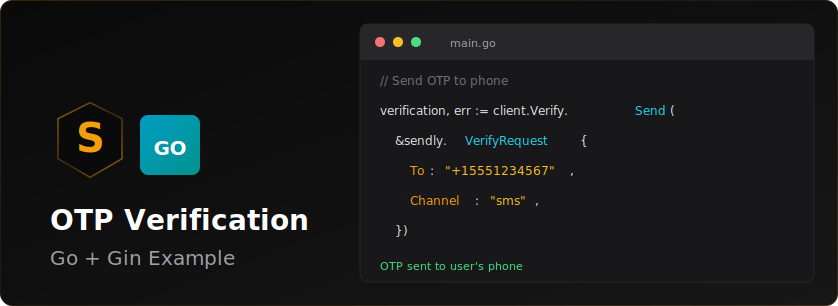

<p align="center">
  
</p>


# Sendly Go OTP Verification Example

A complete example demonstrating phone number verification using Sendly's Go SDK. This example includes a web interface for sending and verifying OTP codes.

## Features

- Send OTP verification codes via SMS
- Verify OTP codes through a web interface
- Clean and modern UI
- Error handling and validation
- Environment variable configuration

## Prerequisites

- Go 1.21 or higher
- A Sendly API key ([Get one here](https://sendly.live))

## Installation

1. Clone or download this example:

```bash
git clone https://github.com/SendlyHQ/sendly-go-otp-example.git
cd sendly-go-otp-example
```

2. Install dependencies:

```bash
go mod download
```

3. Create a `.env` file from the example:

```bash
cp .env.example .env
```

4. Add your Sendly API key to `.env`:

```env
SENDLY_API_KEY=your_sendly_api_key_here
PORT=8080
```

## Running the Application

Start the server:

```bash
go run main.go
```

The application will be available at `http://localhost:8080`

## Usage

1. Open `http://localhost:8080` in your browser
2. Enter a phone number with country code (e.g., +1234567890)
3. Click "Send Verification Code"
4. Check your phone for the SMS with the verification code
5. Enter the 6-digit code on the verification page
6. Click "Verify Code"

## Project Structure

```
sendly-go-otp-example/
├── main.go              # Main application server
├── go.mod               # Go module dependencies
├── templates/           # HTML templates
│   ├── index.html       # Phone input page
│   └── verify.html      # OTP verification page
├── .env.example         # Example environment variables
├── .gitignore          # Git ignore rules
└── README.md           # This file
```

## API Endpoints

### POST /send-otp

Sends an OTP verification code to the provided phone number.

**Request:**
```json
{
  "phone": "+1234567890"
}
```

**Response:**
```json
{
  "success": true,
  "verificationId": "ver_xxxxx"
}
```

### POST /verify-otp

Verifies the OTP code.

**Request:**
```json
{
  "verificationId": "ver_xxxxx",
  "code": "123456"
}
```

**Response:**
```json
{
  "success": true,
  "status": "verified",
  "message": "Phone number verified successfully!"
}
```

## Code Examples

### Sending an OTP

```go
import (
    "context"
    "github.com/SendlyHQ/sendly-go/sendly"
)

client := sendly.NewClient(apiKey)

verification, err := client.Verify.Send(ctx, &sendly.SendVerificationRequest{
    To: "+1234567890",
})

if err != nil {
    log.Fatal(err)
}

fmt.Println("Verification ID:", verification.ID)
```

### Verifying an OTP

```go
result, err := client.Verify.Check(ctx, verificationID, &sendly.CheckVerificationRequest{
    Code: "123456",
})

if err != nil {
    log.Fatal(err)
}

if result.Status == "verified" {
    fmt.Println("Phone number verified successfully!")
}
```

## Building for Production

Build a binary:

```bash
go build -o otp-server
```

Run the binary:

```bash
./otp-server
```

## Environment Variables

| Variable | Description | Required | Default |
|----------|-------------|----------|---------|
| `SENDLY_API_KEY` | Your Sendly API key | Yes | - |
| `PORT` | Server port | No | 8080 |

## Error Handling

The application includes comprehensive error handling for:

- Invalid phone numbers
- Network errors
- Invalid verification codes
- Missing environment variables
- Failed API requests

## Security Notes

- Always keep your `.env` file private and never commit it to version control
- The `.gitignore` file is configured to exclude `.env` files
- API keys should be stored securely and rotated regularly

## Learn More

- [Sendly Documentation](https://sendly.live/docs)
- [Sendly Go SDK](https://github.com/SendlyHQ/sendly-go)
- [Go Documentation](https://golang.org/doc/)

## License

This example is provided as-is for educational purposes.

## Support

For issues related to:
- This example: Open an issue in this repository
- Sendly API: Contact [Sendly Support](https://sendly.live/support)
- Go SDK: Visit the [Sendly Go SDK repository](https://github.com/SendlyHQ/sendly-go)
